# Lemons quality control dataset :lemon:

Lemon dataset has been prepared to investigate the possibilities to tackle the issue of fruit quality control. It contains 2.533 images (300 x 300 pixels). Lemon images are taken on a concrete surface. Dataset also includes empty images of this surface.

## Bad quality examples
| 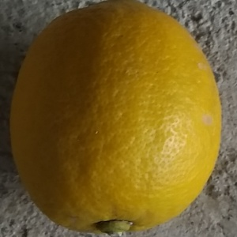 | 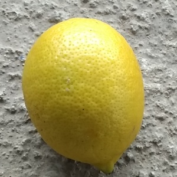 | 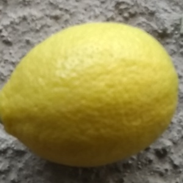 |
| 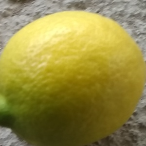 | 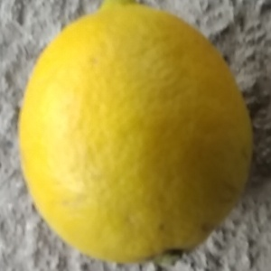 | 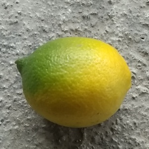 |

## Good quality examples
| 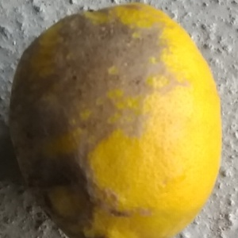 | 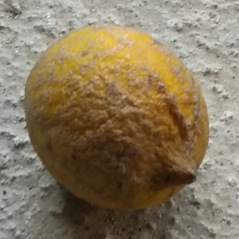 | 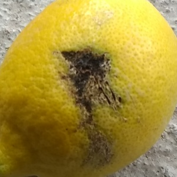 |
| 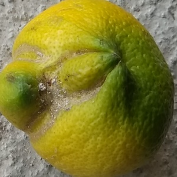 | 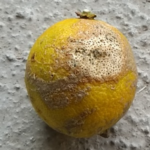 | 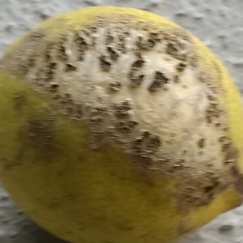 |         

## Empty background examples
| 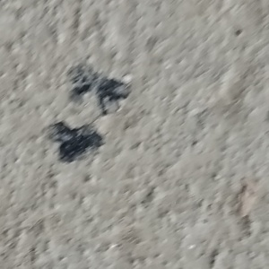 | 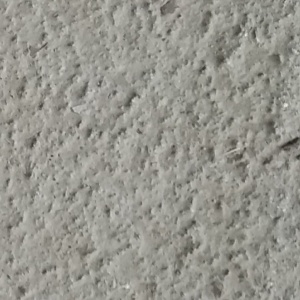 | 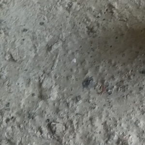 |
| 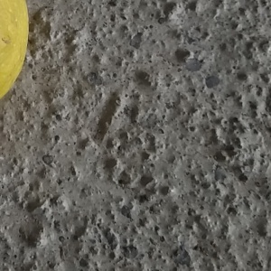 | 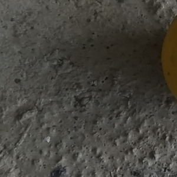 | 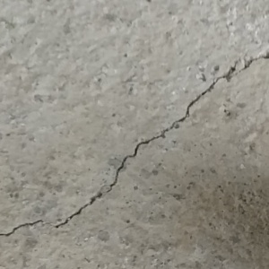 |

Github: https://github.com/robotduinom/lemon_dataset 
Kaggle:                       

